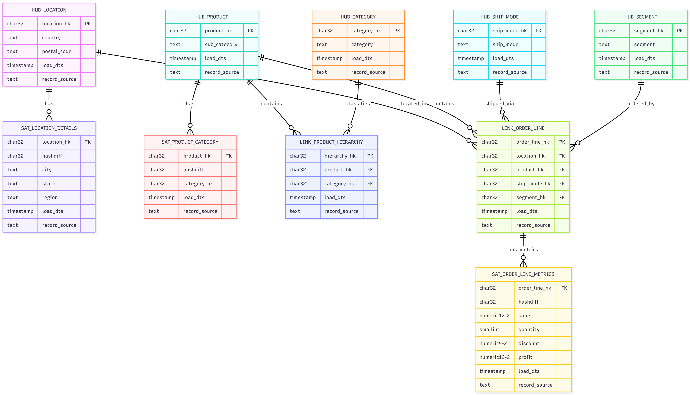

# Data Vault 2.0 Implementation

**HSE University | Системы хранения данных | Итоговое задание модуль 5**

Реализация хранилища данных по методологии Data Vault 2.0 в Greenplum (Yandex Cloud).

---

## Описание проекта

Проект реализует полный цикл ETL для построения хранилища данных по стандарту Data Vault 2.0 на базе датасета Superstore.

**Источник данных:** [Kaggle - Superstore Dataset](https://www.kaggle.com/datasets/roopacalistus/superstore)

**Характеристики датасета:**

- Объем: 9,994 записи
- Атрибуты: 13 колонок (ship_mode, segment, country, city, state, postal_code, region, category, sub_category, sales, quantity, discount, profit)

---

## Архитектура Data Vault

### Компоненты модели

Data Vault 2.0 состоит из трех типов сущностей:

**1. Hubs (Хабы)** - хранят уникальные бизнес-ключи сущностей  
**2. Links (Связи)** - моделируют связи многие-ко-многим между хабами  
**3. Satellites (Сателлиты)** - содержат описательные атрибуты с историей изменений

### Спроектированная модель

#### Hubs (5 таблиц)

| Таблица         | Бизнес-ключ          | Описание                        |
| --------------- | -------------------- | ------------------------------- |
| `hub_location`  | country, postal_code | Географические локации заказов  |
| `hub_product`   | sub_category         | Продукты (уровень подкатегории) |
| `hub_category`  | category             | Категории товаров               |
| `hub_ship_mode` | ship_mode            | Способы доставки                |
| `hub_segment`   | segment              | Сегменты клиентов               |

#### Links (2 таблицы)

| Таблица                  | Связываемые Hub                          | Назначение                        |
| ------------------------ | ---------------------------------------- | --------------------------------- |
| `link_product_hierarchy` | product → category                       | Иерархическая структура продуктов |
| `link_order_line`        | location + product + ship_mode + segment | Транзакционные строки заказов     |

#### Satellites (3 таблицы)

| Таблица                  | Родитель        | Атрибуты                          |
| ------------------------ | --------------- | --------------------------------- |
| `sat_location_details`   | hub_location    | city, state, region               |
| `sat_product_category`   | hub_product     | category_hk (FK)                  |
| `sat_order_line_metrics` | link_order_line | sales, quantity, discount, profit |

### ER-диаграмма



---

## Реализация хэш-ключей

### Принципы Data Vault 2.0

В соответствии с методологией Data Vault используются **суррогатные хэш-ключи** вместо автоинкрементных ID.

### Типы хэш-ключей

### Генерация Hash Keys в Hubs

Hash Key генерируется на основе бизнес-ключей из исходного датасета:

| Hub             | Бизнес-ключ (поля из датасета) | Hash Key                                  |
| --------------- | ------------------------------ | ----------------------------------------- |
| `hub_location`  | `country` + `postal_code`      | `MD5(country \|\| '\|' \|\| postal_code)` |
| `hub_product`   | `sub_category`                 | `MD5(sub_category)`                       |
| `hub_category`  | `category`                     | `MD5(category)`                           |
| `hub_ship_mode` | `ship_mode`                    | `MD5(ship_mode)`                          |
| `hub_segment`   | `segment`                      | `MD5(segment)`                            |

**Разделитель `|`** используется при конкатенации составных ключей для исключения коллизий.

### Генерация Hash Keys в Links

Link Hash Key генерируется из комбинации родительских Hash Keys:

| Link                     | Родительские Hash Keys                                       | Link Hash Key                                                                                      |
| ------------------------ | ------------------------------------------------------------ | -------------------------------------------------------------------------------------------------- |
| `link_product_hierarchy` | `product_hk` + `category_hk`                                 | `MD5(product_hk \|\| '\|' \|\| category_hk)`                                                       |
| `link_order_line`        | `location_hk` + `product_hk` + `ship_mode_hk` + `segment_hk` | `MD5(location_hk \|\| '\|' \|\| product_hk \|\| '\|' \|\| ship_mode_hk \|\| '\|' \|\| segment_hk)` |

## Структура проекта
```

data_vault_superstore/
├── README.md
├── requirements.txt
├── SampleSuperstore.csv
├── config.py
├── utils.py
├── etl.py
├── run.py
└── sql/
├── 01_ddl_staging.sql
├── 02_ddl_hubs.sql
├── 03_ddl_satellites.sql
├── 04_ddl_links.sql
├── 05_load_hubs.sql
├── 06_load_links.sql
└── 07_load_satellites.sql

```

---

## Результаты

### Итоговая статистика таблиц

| Слой | Таблица | Строк | Описание |
|------|---------|-------|----------|
| **Hubs** | hub_category | 3 | Категории: Furniture, Office Supplies, Technology |
| | hub_location | 631 | Уникальные комбинации country + postal_code |
| | hub_product | 17 | Подкатегории товаров |
| | hub_segment | 3 | Сегменты: Consumer, Corporate, Home Office |
| | hub_ship_mode | 4 | Режимы доставки |
| **Links** | link_product_hierarchy | 17 | Связи продукт → категория (1:1) |
| | link_order_line | 6,868 | Уникальные комбинации заказов |
| **Satellites** | sat_location_details | 632 | Детали локаций (1 postal_code = 2 cities) |
| | sat_product_category | 17 | Привязка продуктов к категориям |
| | sat_order_line_metrics | 9,977 | Метрики заказов (17 дублей hashdiff удалены) |

---
